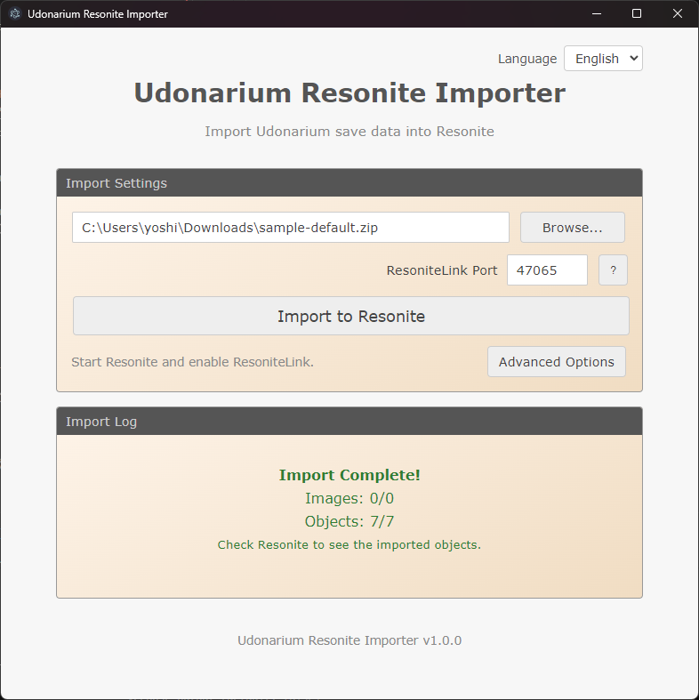

# Udonarium Resonite Importer

A tool to import [Udonarium](https://github.com/TK11235/udonarium) save data into [Resonite](https://resonite.com/) via [ResoniteLink](https://github.com/Yellow-Dog-Man/ResoniteLink).

[日本語版 README](README.ja.md)

## Features

- Import by specifying a ZIP file and the ResoniteLink port
- Supports major objects: characters, cards, terrain, tables, etc.
- Automatic image asset import

## Supported Objects

| Udonarium                 | Resonite Representation                               |
| ------------------------- | ----------------------------------------------------- |
| Character (GameCharacter) | Quad + Texture                                        |
| Dice Symbol (DiceSymbol)  | Quad (face switching)                                 |
| Card                      | Double-sided Quad                                     |
| Card Stack (CardStack)    | Grouped cards                                         |
| Terrain                   | Top + side Quad meshes (walls grouped under one slot) |
| Map Mask (TableMask)      | Quad (semi-transparent support)                       |
| Table (GameTable)         | Quad                                                  |

## Requirements

- Resonite with ResoniteLink enabled

## Installation

Download the latest package from [GitHub Releases](https://github.com/TriVR-TRPG/udonarium-resonite-importer/releases/latest).

- GUI (Windows/macOS): download and extract the GUI ZIP package
- CLI (Windows/macOS/Linux): download and extract the CLI ZIP package for your platform

## Usage

### GUI Version (Recommended)

1. Download and extract the GUI package from Releases
2. Launch `Udonarium Resonite Importer` (`.exe` on Windows / `.app` on macOS)
3. Click "Browse..." to select a Udonarium ZIP file
4. In Resonite, enable ResoniteLink and set the port
5. Click "Import to Resonite"



### CLI Version

Use the executable inside the extracted CLI ZIP package.

```bash
# Windows
.\udonarium-resonite-importer.exe -i .\save.zip -p 7869

# macOS
./udonarium-resonite-importer-macos -i ./save.zip -p 7869

# Linux
./udonarium-resonite-importer-linux -i ./save.zip -p 7869
```

### CLI Options

| Option      | Short | Description                   | Default     |
| ----------- | ----- | ----------------------------- | ----------- |
| `--input`   | `-i`  | Input ZIP file path           | (required)  |
| `--port`    | `-p`  | ResoniteLink port             | (required, not needed in `--dry-run`) |
| `--host`    | `-H`  | ResoniteLink host             | localhost   |
| `--scale`   | `-s`  | Scale factor                  | 1 (m)       |
| `--enable-character-collider-on-locked-terrain` | - | Enable CharacterCollider on locked Terrain | false |
| `--dry-run` | `-d`  | Analysis only (no connection) | false       |
| `--verbose` | `-v`  | Verbose output                | false       |
| `--lang`    | `-l`  | Language (en, ja)             | Auto-detect |
| `--help`    | `-h`  | Display help                  | -           |
| `--version` | `-V`  | Display version               | -           |

## License

MIT

## Related Links

- [Udonarium](https://github.com/TK11235/udonarium) - Web-based virtual tabletop
- [ResoniteLink](https://github.com/Yellow-Dog-Man/ResoniteLink) - Resonite integration tool
- [tsrl](https://www.npmjs.com/package/@eth0fox/tsrl) - TypeScript library used for ResoniteLink connectivity

